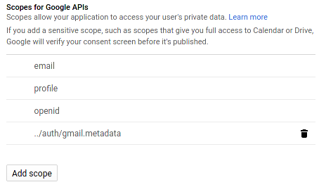

# prometheus-gmail-exporter

Checks gmail labels for unread messages and exposes the counts via prometheus.

There is a blog [article about why this was created, with an example integration to Grafana](https://medium.com/james-reads-public-cloud-technology-blog/watching-gmail-labels-with-prometheus-grafana-87b6745acd48).

## Example prometheus Metrics

```sh
# HELP gmail_INBOX_total INBOX Total
# TYPE gmail_INBOX_total gauge
gmail_INBOX_total 44351.0
# HELP gmail_INBOX_unread INBOX Unread
# TYPE gmail_INBOX_unread gauge
gmail_INBOX_unread 43.0
# HELP gmail_Label_33_total >/0. Triage Total
# TYPE gmail_Label_33_total gauge
gmail_Label_33_total 159.0
# HELP gmail_Label_33_unread >/0. Triage Unread
# TYPE gmail_Label_33_unread gauge
gmail_Label_33_unread 0.0
```

## Getting `client_secrets.json`

* Go to the Google Developers API Console: https://console.developers.google.com/apis/credentials
* Create Credentials -> OAuth Client ID 
** Application Type: Other
* Click the "down arrow" icon to download your credentials file - `client_secret___.json`.
* Create a OAuth 2 Consent screen with whatever name and icon you like. The scopes needed are; 



* Rename your downloaded `client_secret_____.json` to just `client_secret.json`
  and put it in the directory; `~/.prometheus-gmail-exporter/`. 

## Running via as a container image

There is a published container in **hub.docker.com**, called `jamesread/prometheus-gmail-exporter:latest`. 

Using either `docker` or `podman` will be fine. I like `podman` better, so
examples are with podman.

```
podman run jamesread/prometheus-gmail-exporter:latest -v ~/.prometheus-gmail-exporter/:/root/.prometheus-gmail-exporter/
```

## Building your own container image

```
podman build . -t gmail-exporter
podman run -v ~/.prometheus-gmail-exporter/:/root/.prometheus-gmail-exporter/ gmail-exporter Label_33
```

## Running via command line

### Python3 dependencies

* configargparse
* oauth2client
* google-api [ -core, if installed with pip, or -client if yum+rpm ]. 
* httplib2

Then, simply;

```
./gmail-prometheus.py Label_33 INBOX
```

Options can be found with `--help`. 
